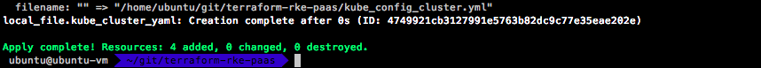
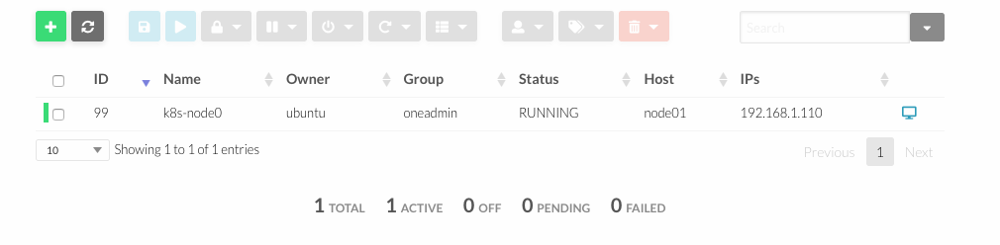

## Deploy Rancher HA in OpenNebula with Terraform and RKE


### Installation 

####  Install Terraform 

To install Terraform, find the appropriate package for your system and download it

	$ curl -O https://releases.hashicorp.com/terraform/0.11.10/terraform_0.11.10_linux_amd64.zip

After downloading Terraform, unzip the package

	$ sudo mkdir /bin/terraform
	$ sudo unzip terraform_0.11.10_linux_amd64.zip -d /bin/terraform

After installing Terraform, verify the installation worked by opening a new terminal session and checking that terraform is available. 
	
	$ export PATH=$PATH:/bin/terraform
	$ terraform --version

####  Add Terraform providers for Opennebula and RKE

You need to install go first: https://golang.org/doc/install

Install Prerequisites

	$ sudo apt install bzr

Use the `wget` command and the link from Go to download the tarball:

	$ wget https://dl.google.com/go/go1.10.linux-amd64.tar.gz

The installation of Go consists of extracting the tarball into the `/usr/local` 

	$ sudo tar -C /usr/local -xvzf  go1.10.linux-amd64.tar.gz 

We will call our workspace directory projects, but you can name it anything you would like. The `-p` flag for the `mkdir` command will create the appropriate directory tree

	$ mkdir -p ~/projects/{bin,pkg,src}

To execute Go like any other command, we need to append its install location to the $PATH variable.

	$ export PATH=$PATH:/usr/local/go/bin

Additionally, define the GOPATH and GOBIN Go environment variables:
	
	$ export GOBIN="$HOME/projects/bin"
	$ export GOPATH="$HOME/projects/src"

After go is installed and set up, just type:

    $ go get github.com/blackberry/terraform-provider-opennebula
    $ go install github.com/blackberry/terraform-provider-opennebula 

#### Post-installation Step

Copy your **terraform-provider-opennebula** binary in a folder, like `/usr/local/bin`, and write this in `~/.terraformrc`:

	$ sudo cp ~/projects/bin/terraform-provider-opennebula /usr/local/bin/terraform-provider-opennebula

For RKE provider, download the binary and copy in the same folder:

	$ wget https://github.com/yamamoto-febc/terraform-provider-rke/releases/download/0.5.0/terraform-provider-rke_0.5.0_linux-amd64.zip 
	$ sudo unzip terraform-provider-rke_0.5.0_linux-amd64.zip -d /usr/local/bin/terraform-provider-rke

```
providers {
  opennebula = "/usr/local/bin/terraform-provider-opennebula"
}

providers {
  rke = "/usr/local/bin/terraform-provider-rke"
}
```

## Install Rancher

This repository provide a `TF file` to install Rancher in a high-availability configuration. The goal is easily install a Rancher on machines running CentOS 7.

	$ git clone https://github.com/mangelft/terraform-rke-paas.git

First, initialize Terraform for your project. This will read your configuration files and install the plugins for your provider:

	$ terraform init

In a terminal, go into the folder where you created main.tf, and run the `terraform plan` command. The plan command lets you see what Terraform will do before actually doing it. To actually create the instance, run the `terraform apply` command:




###  Required Tools

The following CLI tools are required for this install. Please make sure these tools are installed and available:

* kubectl - Kubernetes command-line tool.
* helm - Package management for Kubernetes.

#### Install required tools (Ubuntu)
	$ sudo apt install snap
	$ sudo snap install kubectl --classic
	$ sudo snap install helm --classic 

#### Install Tiller on the Cluster
Helm installs the `tiller` service on your cluster to manage charts

	$ kubectl -n kube-system create serviceaccount tiller
	$ kubectl create clusterrolebinding tiller  --clusterrole cluster-admin --serviceaccount=kube-system:tiller
	$ helm init --service-account tiller

#### Test your Tiller installation

	$ kubectl -n kube-system  rollout status deploy/tiller-deploy
	$ helm version

#### Add the Helm Chart Repository

	$ helm repo add rancher-stable https://releases.rancher.com/server-charts/stable

#### Install cert-manager

	$ helm install stable/cert-manager --name cert-manager --namespace kube-system

####  Install Rancher Generated Certificates

	$ helm install rancher-stable/rancher --name rancher --namespace cattle-system --set hostname=rancher.my.org

## Author

 * Miguel Ángel Flores - (miguel.angel.flores@csuc.cat)

