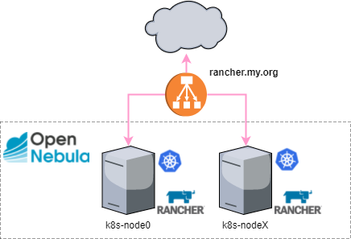
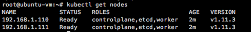
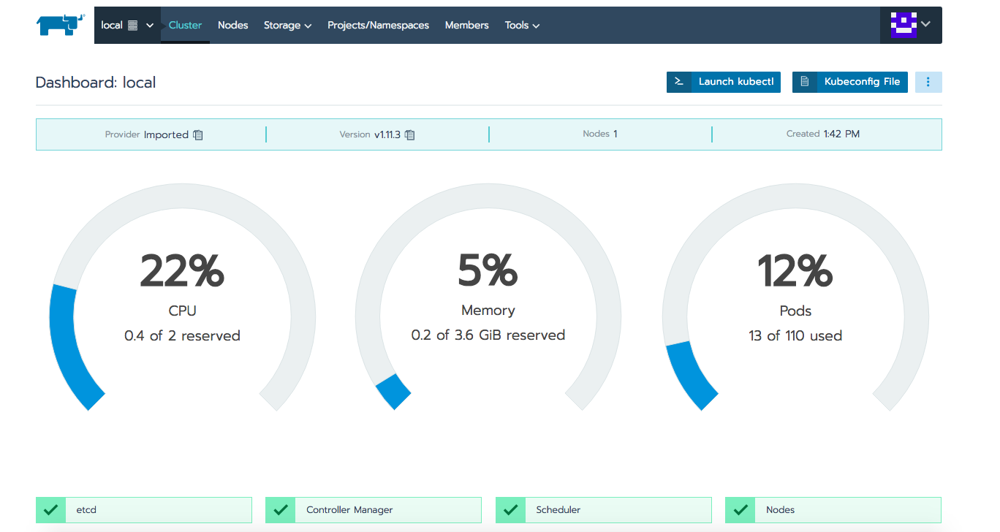

## Deploy Rancher HA in OpenNebula with Terraform and RKE

Terraform files for deploying a Rancher HA cluster in OpenNebula

### Architecture



### Installation 

> **Important:** RKE add-on install is only supported up to Rancher v2.0.8.

####  Install Terraform 

To install Terraform, find the appropriate package for your system and download it

	$ curl -O https://releases.hashicorp.com/terraform/0.11.12/terraform_0.11.12_linux_amd64.zip

After downloading Terraform, unzip the package

	$ sudo unzip terraform_0.11.12_linux_amd64.zip -d /usr/local/bin

After installing Terraform, verify the installation worked by opening a new terminal session and checking that terraform is available. 
	
	$ terraform --version

####  Add Terraform providers for Opennebula and RKE

You need to install go first: https://golang.org/doc/install

Install Prerequisites

##### Ubuntu

	$ sudo apt install bzr

##### CentOS/RHEL 7

	$ sudo yum install -y bzr

Use the `wget` command and the link from Go to download the tarball:

	$ curl -O https://dl.google.com/go/go1.12.linux-amd64.tar.gz

The installation of Go consists of extracting the tarball into the `/usr/local` 

	$ sudo tar -C /usr/local -xvzf  go1.12.linux-amd64.tar.gz 

We will call our workspace directory projects, but you can name it anything you would like. The `-p` flag for the `mkdir` command will create the appropriate directory tree

	$ mkdir -p ~/projects/{bin,pkg,src}

To execute Go like any other command, we need to append its install location to the $PATH variable.

	$ export PATH=$PATH:/usr/local/go/bin

Additionally, define the GOPATH and GOBIN Go environment variables:
	
	$ export GOBIN="$HOME/projects/bin"
	$ export GOPATH="$HOME/projects/src"

After go is installed and set up, just type:

    $ go get github.com/blackberry/terraform-provider-opennebula
    $ go install github.com/blackberry/terraform-provider-opennebula 

#### Post-installation Step

Copy your **terraform-provider-opennebula** binary in a folder, like `/usr/local/bin`, and write this in `~/.terraformrc`:

	$ sudo cp ~/projects/bin/terraform-provider-opennebula /usr/local/bin/terraform-provider-opennebula

For RKE provider, download the binary and copy in the same folder:

	$ wget https://github.com/yamamoto-febc/terraform-provider-rke/releases/download/0.5.0/terraform-provider-rke_0.5.0_linux-amd64.zip 
	$ sudo unzip terraform-provider-rke_0.5.0_linux-amd64.zip -d /usr/local/bin/terraform-provider-rke

```
providers {
  opennebula = "/usr/local/bin/terraform-provider-opennebula"
}

providers {
  rke = "/usr/local/bin/terraform-provider-rke"
}
```

## Install Rancher

This repository provide a `TF file` to install Rancher in a high-availability configuration. The goal is easily install a Rancher on machines running CentOS 7.

Clone this repo:

	$ git clone https://github.com/mangelft/terraform-rke-paas.git

### Create infrastructure

First we have to initialize terraform simply with:

	$ terraform init

This will read your configuration files and install the plugins for your provider.

We let terraform create a plan, which we can review:

	$ terraform plan

The plan command lets you see what Terraform will do before actually doing it.

Now we execute: 

	$ terraform apply


Kubectl is the CLI tool for interacting with the Kubernetes cluster. Please make sure these tools are installed and available.

To make sure it works, run a simple `get nodes` command.

	$ kubectl get nodes



That’s it you should have a functional Rancher server. Point a browser at the hostname: https://rancher.my.org.



## Author

 * Miguel Ángel Flores - (miguel.angel.flores@csuc.cat)

